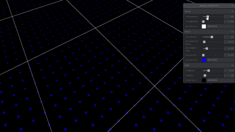
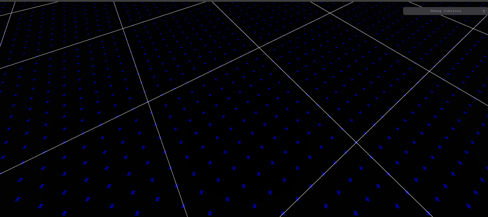

# 🎛️ R3F-TSL-Grid-Shader

This project is a 🌐 grid shader built with **React Three Fiber**, **Three.js Shading Language (TSL)**, **TypeScript**, **Tweakpane**, and **Vite**. It aims to create a visually appealing and customizable grid effect inspired by Bruno Simon and Ben Gokus.

---

## 📸 Preview

### 🎞️ Animated Preview


### 🖼️ Screenshot


---

## ✨ Features

- 🧭 **Major and Plus Grid:** Renders a major grid and a smaller “+” grid for finer detail and density control.
- 🎨 **Customizable Grid Size and Color:** Adjust the frequency, thickness, and color of grid lines.
- ➕ **Plus Marker Control:** Control size, count, spacing, and color of “+” symbols.
- 🌫️ **Fog Support:** Add depth with exponential fog — control density and color interactively.
- ⚡ **Performance Optimized:** Powered by Vite for lightning-fast dev and builds.
- 🧠 **TypeScript + TSL Integration:** Benefit from type safety and shader node magic.
- 🧩 **React Three Fiber:** Integrates smoothly with React.

---

## 🧰 Technologies Used

- [`react-three-fiber`](https://docs.pmnd.rs/react-three-fiber/)
- [`three.js`](https://threejs.org/) (with `webgpu`)
- [`three/tsl`](https://github.com/mrdoob/three.js/tree/dev/examples/jsm/nodes) — Three.js Shading Language
- [`tweakpane`](https://cocopon.github.io/tweakpane/)
- `TypeScript`, `Vite`

---

## 💡 Inspiration

This project draws inspiration from:

- 🧠 **Bruno Simon’s new portfolio** grid effect (YouTube):  
  [https://www.youtube.com/watch?v=OBZtVz6IM18&t=635s](https://www.youtube.com/watch?v=OBZtVz6IM18&t=635s)

- 📘 **Article:**  
  ["The Best Darn Grid Shader (Yet)"](https://bgolus.medium.com/the-best-darn-grid-shader-yet-727f9278b9d8) by Ben Gokus

---

## 🚀 Installation

1. **Clone the repository:**
    ```bash
    git clone <repository-url>
    cd r3f-tsl-grid-shader
    ```

2. **Install dependencies:**
    ```bash
    npm install
    ```

3. **Run the development server:**
    ```bash
    npm run dev
    ```

4. Open your browser and navigate to `http://localhost:5173`.

---

## 🧪 Usage

Once the dev server is running, tweak values live:

- 🔁 **Frequency / Line Width** of the main grid
- ➕ **Size / Spacing** of the plus grid
- 🎨 **Grid / Plus / Fog Colors**
- 🌫️ **Fog Density** for atmospheric fading
- 🎥 **Camera Position** using Tweakpane sliders

---

## 🙌 Contributing

Contributions welcome! Feel free to:

- 🐛 Report issues
- 🌟 Suggest enhancements
- 📦 Open PRs

---

## 📄 License

Licensed under the MIT License. See the [LICENSE](LICENSE) file for details.
